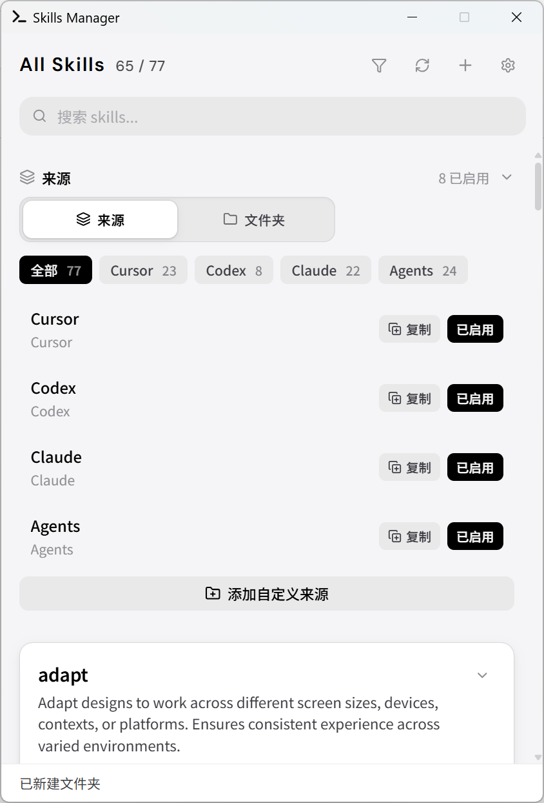
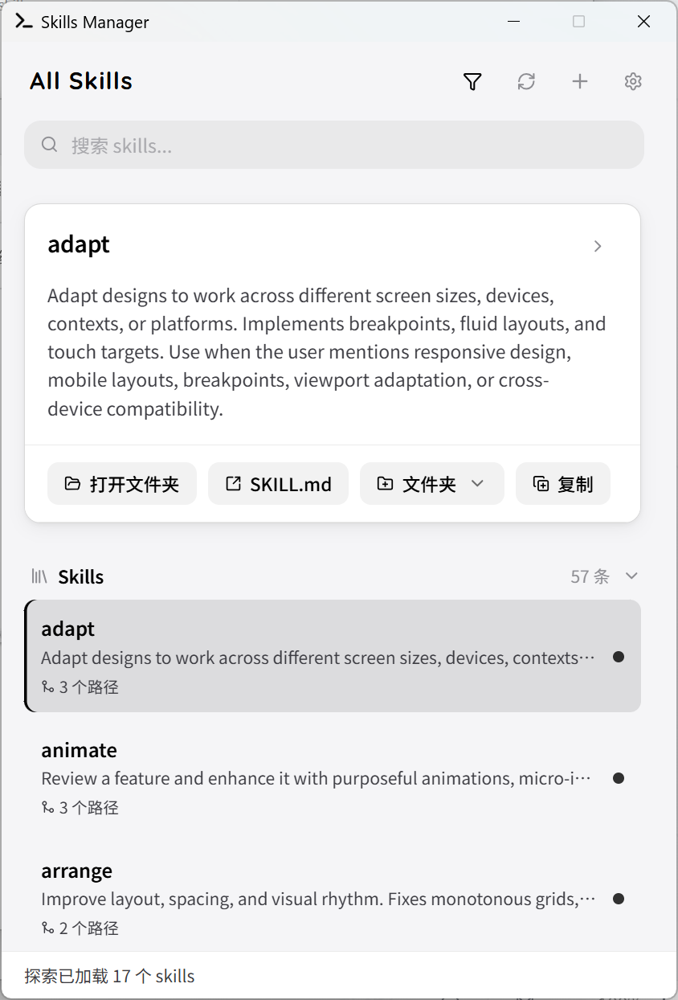

# Skills Manager

[](https://tauri.app) [](https://react.dev) [](https://www.typescriptlang.org/) [](https://www.rust-lang.org/) [](https://vitejs.dev/)

> 基于 Tauri + React 的轻量Windows桌面托盘应用，集中管理多个 AI Agent 工具的 `SKILL.md` 文件。

支持 Cursor、Codex、Claude Code、Windsurf、Amp 等工具的 skills 目录，统一扫描、浏览、编辑与跨来源复制。

<table>
  <tr>
    <td></td>
    <td></td>
  </tr>
</table>

## 功能特性

- **多来源聚合** — 同时扫描 `~/.cursor/skills`、`~/.codex/skills`、`~/.claude/skills`、`~/.agents/skills`、Windsurf、Amp 等目录；在「全部来源」视图中，内容相同的 skill 可合并为一条并展示多处路径
- **探索（Explore）** — 内置若干 GitHub 公共 skill 仓库索引（如 anthropics/skills、obra/superpowers 等），支持按分类浏览、搜索、预览正文；可将远程 skill **安装**到本机**可写**来源（需网络访问 GitHub）
- **搜索筛选** — 按名称、描述、来源、路径和正文检索；支持仅显示可编辑来源
- **预览与编辑** — 查看完整 SKILL.md 原文、附件列表；直接新建或编辑 skill；编辑时粘贴以 `name:` / `description:` 开头的片段可自动识别元数据
- **跨来源复制** — 复制单个 skill 或整个来源，支持 rename / overwrite / skip 冲突策略
- **文件夹（Collections）** — 本机虚拟文件夹，通过引用组织 skill，不复制磁盘文件
- **自定义来源** — 手动添加目录或使用系统对话框选择；支持导入/导出 JSON 配置
- **系统托盘** — 关闭窗口后驻留托盘，支持快速显示/隐藏、重新扫描、退出

## 快速开始

### 前置要求

- Node.js 20+、npm
- Rust stable 1.77.2+
- [Tauri 2 系统依赖](https://v2.tauri.app/start/prerequisites/)

### 安装与运行

```bash
npm install
npm run tauri dev
```

> [!IMPORTANT]
> `npm run dev` 仅启动浏览器预览，文件扫描、保存等功能需通过 `npm run tauri dev` 启动 Tauri 运行时。

### 构建

```bash
npm run tauri build
```

构建产物位于 `src-tauri/target/release/`，包含便携版 exe、NSIS 安装包和 MSI 安装包。

### 常用命令

| 命令 | 说明 |
| --- | --- |
| `npm run tauri dev` | 启动桌面开发环境 |
| `npm run tauri build` | 构建并打包桌面应用 |
| `npm run dev` | 仅启动 Vite 浏览器预览 |
| `npm run build` | 构建前端资源 |
| `npm run lint` | 运行 ESLint |
| `npm run test` | 运行测试 |

## 安全与权限

> [!NOTE]
> 以下仅说明本应用如何访问磁盘与网络；不包含 Cursor / Claude 等各工具自身的服务条款。

- **本地文件**：仅处理您在应用中**启用**的各**来源根目录**（默认如 `~/.cursor/skills` 等，以及自定义或经系统对话框添加的路径）。递归查找 `SKILL.md`，并跳过 `.git`；不会对未配置的磁盘路径做后台全盘扫描。
- **写入**：新建、保存与跨来源复制只会在您主动操作时执行，且目标来源须为可写。
- **网络**：不向本项目任何服务器上传 skill 内容。使用**探索**时通过 HTTPS 访问 GitHub（仓库目录树与原始 `SKILL.md`）；需公网，并可能受 GitHub API 常规速率限制。
- **本机状态**：来源列表、Collections、筛选与视图等保存在 WebView `localStorage`，仅驻留本机。托盘与文件夹选择使用系统原生能力。

## Skill 目录结构

```text
my-skill/
├─ SKILL.md
└─ notes.md        # 可选附件
```

支持带命名空间的层级：

```text
.system/tools/my-skill/
├─ SKILL.md
└─ examples.md
```

`SKILL.md` 推荐使用 frontmatter 声明元数据：

```md
---
name: my-skill
description: 描述该 skill 的用途
---

# My Skill

## Instructions
描述 agent 如何使用此 skill。
```

## 技术栈

- **前端**：React 19 · TypeScript 5.9 · Vite 8
- **桌面**：Tauri 2
- **后端**：Rust 2021

## 开发说明

### 项目结构

根目录保留 Vite 约定的 `index.html`、npm 的 `package.json`，以及 TypeScript 的解决方案入口 `tsconfig.json`（通过 `references` 指向 `config/` 内的子配置）。具体工具配置均在 `config/` 目录。

| 目录 | 职责 |
| --- | --- |
| `config/` | Vite / Vitest / ESLint / TypeScript 工程配置（除根级 `tsconfig.json` 解决方案入口） |
| `src/` | 前端界面、来源管理、搜索筛选、预览与编辑、探索模式 |
| `src/lib/` | Skill 元数据解析、探索 API 封装、来源持久化、UI 状态 |
| `src-tauri/src/` | 文件扫描、写入、目录复制、GitHub 探索索引与拉取、托盘与窗口管理 |
| `public/` | 静态资源（构建时原样复制） |
| `assets/readme/` | README 截图等文档用资源 |

使用 Cursor 时可在本地自建 `.cursor/`（含 `rules/` 等）；该目录已在 `.gitignore` 中忽略。

### 版本号同步

发布时需同步以下三处版本：`package.json`、`src-tauri/tauri.conf.json`、`src-tauri/Cargo.toml`。

### CI

推送或 PR 时 GitHub Actions 会运行前端 lint / test / build 和 Rust clippy / test。详见 `.github/workflows/ci.yml`。

## Roadmap

- [x] 原生目录选择器
- [x] 本机文件夹（Collections）
- [x] 导入 / 导出配置
- [x] 探索：精选Skill库
- [ ] skill 搜索
