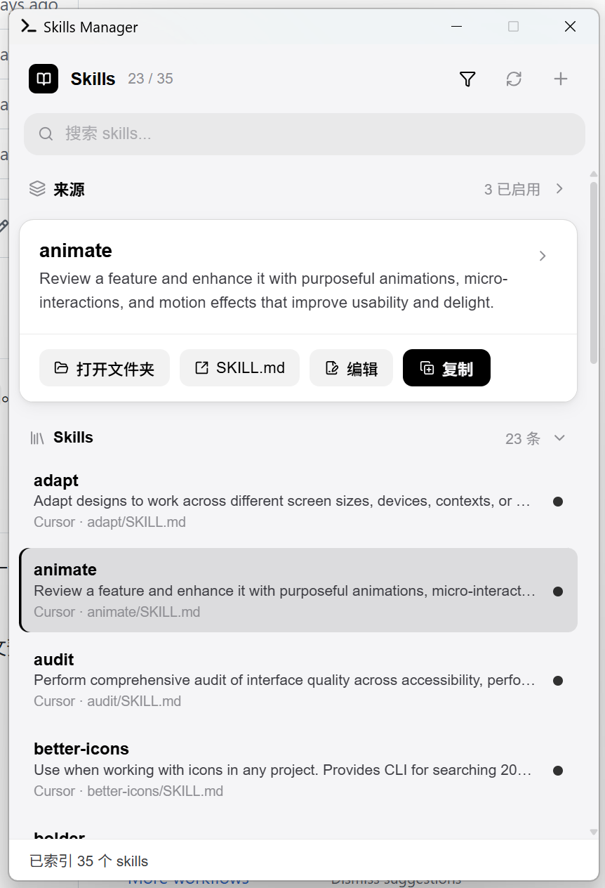
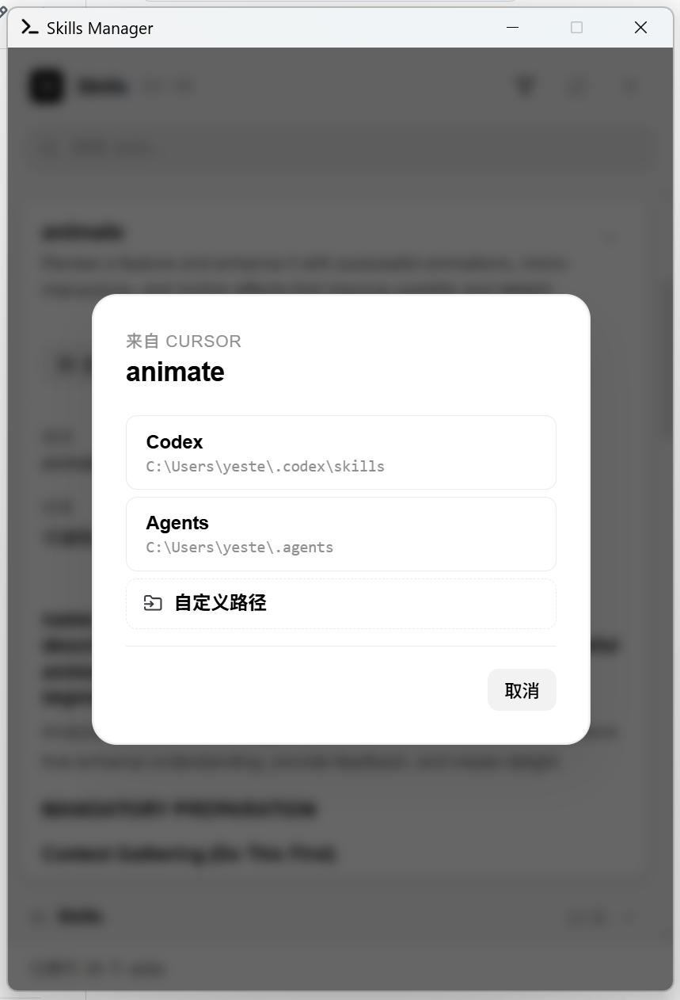

# Skills Manager

一个基于 `Tauri` + `React` 构建的超轻量 Windows 托盘插件，用来集中管理 `Cursor`、`Codex` 和自定义目录中的 `SKILL.md`。

[概览](#概览) • [功能特性](#功能特性) • [快速开始](#快速开始) • [使用方式](#使用方式) • [Skill 目录结构](#skill-目录结构) • [开发说明](#开发说明) • [Roadmap](#roadmap)

## 概览

`Skills Manager` 是一个面向 `SKILL.md` 工作流的桌面管理工具，用来把分散在不同目录里的 agent skills 收拢到同一个界面中统一维护。

基于 `Tauri` + `React` 构建，可以直接连接本地文件系统的桌面应用。你可以在这里完成来源扫描、搜索筛选、原文预览、技能编辑、跨来源复制和来源管理，把原本需要频繁切换文件夹与编辑器的流程集中到一个轻量工作台中。

该项目适合以下场景：

- 同时维护 `~/.cursor/skills`、`~/.codex/skills` 和团队自定义技能目录
- 在一个桌面面板中快速搜索、浏览和预览 skill 内容与附加文件
- 直接新建、编辑、复制单个 skill，或批量复制整个来源并处理冲突
- 通过来源开关、可写筛选和托盘入口，把日常 skill 维护流程收拢成一个统一入口

<table>
  <tr>
    <td></td>
    <td></td>
  </tr>
</table>


## 功能特性

- 多来源聚合：同时扫描多个 skill 根目录，并支持按来源筛选
- 默认来源开箱即用：内置 `Cursor / Personal`、`Codex / Personal` 和 `Cursor / Built-in`
- 自定义来源管理：支持手动或系统文件夹对话框添加、启用/停用和删除自定义目录；支持将来源配置 **导出 / 导入 JSON** 以便备份或多机同步
- Skill 检索：按名称、描述、来源、相对路径和正文摘要进行搜索
- 只看可编辑内容：一键过滤只读来源，聚焦可修改的 skill
- 原始内容预览：查看完整 `SKILL.md`、路径、命名空间和目录附件
- 新建与编辑：自动生成标准模板，并按 `[namespace/]<slug>/SKILL.md` 组织路径
- 跨来源复制：支持复制单个 skill 或整个来源到目标，可复制到内置来源或自定义路径，冲突时支持 `rename`、`overwrite`、`skip`
- 桌面托盘交互：支持显示/隐藏窗口、重新扫描和退出应用
- 快捷浏览：支持方向键在 skill 列表间移动

## 快速开始

### 前置要求

- `Node.js` 20+（推荐）
- `npm`
- `Rust` stable 1.77.2+
- Tauri 2 的系统依赖，参考官方文档：[Tauri prerequisites](https://v2.tauri.app/start/prerequisites/)

### 安装依赖

```bash
npm install
```

### 启动桌面应用

```bash
npm run tauri dev
```

应用启动后会以托盘面板形式运行。点击托盘图标可显示或隐藏窗口。

### 构建、产物与直接运行

如果你只是想正常使用这个应用，而不是继续开发它，需要区分下面三种场景：

- `npm run tauri dev`：开发模式。适合一边改代码一边调试，通常会配合编辑器和终端使用。
- `npm run tauri build`：发布模式。用于生成最终成品，只需要在准备发布新版本时执行一次。
- 直接运行 `exe` 或安装包：最终使用方式。构建完成后不再依赖 `npm`、源码目录或编辑器。

也就是说，`npm run tauri build` 不是每次打开应用都要执行的命令。它更像“出厂打包”，执行完成后就可以直接运行生成的程序。

> [!IMPORTANT]
> `npm run dev` 只会启动浏览器预览，用于查看前端界面。真正的扫描、保存、复制、打开路径和托盘功能依赖 Tauri 运行时，请使用 `npm run tauri dev`。

在 Windows 上，构建完成后常见产物路径如下：

- 便携版可执行文件：`src-tauri/target/release/skills-manager.exe`
- NSIS 安装包：`src-tauri/target/release/bundle/nsis/Skills Manager_0.1.0_x64-setup.exe`
- MSI 安装包：`src-tauri/target/release/bundle/msi/Skills Manager_0.1.0_x64_en-US.msi`

如果你想获得类似“下载后双击即可打开”的体验，可以优先使用 `skills-manager.exe`；如果你想把应用正式分发给其他人安装，建议使用安装包。

### 常用命令


| 命令                    | 说明                     |
| --------------------- | ---------------------- |
| `npm run tauri dev`   | 启动 Tauri 桌面开发环境，适合本地调试 |
| `npm run dev`         | 仅启动 Vite 浏览器预览         |
| `npm run build`       | 构建前端资源                 |
| `npm run tauri build` | 构建并打包桌面应用，生成最终可分发产物    |
| `npm run lint`        | 运行 ESLint              |


## 使用方式

### 1. 默认来源

应用首次启动会自动加载以下来源：


| 来源                  | 默认路径                      | 可写  | 说明               |
| ------------------- | ------------------------- | --- | ---------------- |
| `Cursor / Personal` | `~/.cursor/skills`        | 是   | 个人 Cursor skills |
| `Codex / Personal`  | `~/.codex/skills`         | 是   | 个人 Codex skills  |
| `Cursor / Built-in` | `~/.cursor/skills-cursor` | 否   | 内置技能，默认只读        |


> [!NOTE]
> `~` 表示当前用户目录。在 Windows 上通常对应 `C:\Users\<你的用户名>`。

### 2. 添加自定义来源

在“来源”区域中可以：

- 输入来源名称与文件夹路径（可点击 **浏览…** 使用系统文件夹选择对话框）
- 选择是否为可编辑来源
- 使用 **导出来源配置** / **导入来源配置** 将自定义来源与默认来源的启用状态存为 JSON（导入会替换现有自定义来源并应用文件中的默认来源开关）

来源配置和启用状态会保存在本地 `localStorage` 中，因此重新打开应用后仍会保留。

导出文件为 JSON，`schemaVersion` 当前为 `1`，包含 `customSources`（完整条目）与 `defaultSourceFlags`（仅默认来源 id 与 `enabled`）。在本机导入时，默认来源的 `rootPath` 仍以当前环境与 `get_default_sources` 为准，避免把另一台机器的路径写死进来。

### 3. 浏览与筛选

你可以通过以下方式缩小范围：

- 搜索关键字
- 按来源筛选
- 仅显示可编辑来源

技能列表会显示匹配结果数量，详情区会展示：

- `SKILL.md` 原文
- 相对路径
- 命名空间
- 来源权限
- 同目录下的附件名称

### 4. 新建或编辑 skill

对于可写来源，你可以：

- 新建一个 skill
- 直接编辑现有 `SKILL.md`
- 基于当前 skill 再创建一个新 skill

创建时会自动生成如下结构的路径：

```text
[namespace/]<slug>/SKILL.md
```

例如：

```text
.system/tools/my-skill/SKILL.md
```

### 5. 复制 skill 或来源

复制会复制整个 skill 目录（或整个来源下的所有 skills），不是只复制 `SKILL.md`。

支持两种复制方式：

- **复制单个 skill**：在 skill 详情区点击复制，选择目标来源或输入自定义路径
- **复制整个来源**：在来源管理区点击复制，将该来源下所有 skills 批量复制到目标来源

根目录下的 skill（无子目录）无法直接复制，需先移到单独文件夹中。

支持三种冲突策略：

- `rename`：保留目标已有目录，为新副本自动追加 `-copy`
- `overwrite`：覆盖目标已有 skill 目录
- `skip`：跳过已存在目标

### 6. 托盘行为

- 关闭主窗口时，应用不会退出，而是隐藏到托盘
- 托盘菜单支持“显示 / 隐藏”、“重新扫描”和“退出”
- 点击托盘图标可快速切换窗口显示状态

> [!TIP]
> 如果你关闭窗口后“看起来像退出了”，其实应用仍在托盘中运行，需要通过托盘菜单执行真正的退出。

## Skill 目录结构

应用以目录为单位识别和复制 skill。最小可用结构如下：

```text
my-skill/
├─ SKILL.md
└─ notes.md
```

也支持带命名空间的层级组织：

```text
.system/
└─ tools/
   └─ my-skill/
      ├─ SKILL.md
      ├─ examples.md
      └─ assets/
```

`SKILL.md` 推荐使用 frontmatter 来声明基础元数据：

```md
---
name: my-skill
description: Explain when and how this skill should be used.
---

# My Skill

## Instructions
Describe how the agent should use this skill.
```

如果没有 frontmatter，应用会回退到目录名和正文摘录来生成标题与描述。

## 开发说明

### 技术栈

- 前端：`React 19`、`TypeScript 5.9`、`Vite 8`
- 桌面层：`Tauri 2`
- 后端：`Rust 2021`
- 主要依赖：`@tauri-apps/api`、`lucide-react`、`clsx`、`marked`、`dompurify`（预览 HTML 消毒）、`walkdir`、`serde`

### 代码职责

- `src/`：前端界面、来源管理、搜索筛选、预览、编辑和复制弹窗
- `src/lib/`：skill 元数据解析、来源持久化、UI 状态持久化
- `src-tauri/src/lib.rs`：本地文件扫描、写入、目录复制、打开路径、托盘与窗口行为

### 当前实现注意点

- 浏览器模式下不提供真实文件系统能力，仅用于 UI 预览；详情区 Markdown 预览经 **DOMPurify** 消毒后再插入 DOM，降低恶意 `SKILL.md` 的脚本注入风险
- 「在资源管理器 / Finder 中打开」在 Windows（`explorer` / `start`）、macOS（`open`）与 Linux（`xdg-open`）上均有实现；托盘与主要交互仍以 Windows 为优先验证环境
- 桌面版下添加自定义来源时可使用原生文件夹选择对话框；导入配置仅替换自定义来源列表，默认路径仍来自本机 `get_default_sources`
- 不存在或不可访问的来源目录会在扫描时被跳过

### 版本号

发布或打标签时请同步以下三处版本，避免安装包与文档不一致：

| 位置 | 文件 |
| --- | --- |
| 前端与脚本 | `package.json` 的 `version` |
| Tauri 产物 | `src-tauri/tauri.conf.json` 的 `version` |
| Rust 包 | `src-tauri/Cargo.toml` 的 `version` |

### 持续集成

推送至默认分支或发起 PR 时，GitHub Actions 会运行前端 `lint`、`test`、`build` 以及 `src-tauri` 的 `cargo clippy` 与 `cargo test`。详见仓库内 `.github/workflows/ci.yml`。

## 为什么这个项目有用

如果你经常在不同 agent 生态之间维护技能包，`Skills Manager` 能把分散在文件系统中的 `SKILL.md` 重新组织成一个统一的工作台，让你更快完成：

- 查看已有 skill
- 复制和迁移 skill
- 维护个人 skill 库
- 区分只读内置技能和可编辑技能

对于重度使用 `Cursor`、`Codex` 或自定义 skills 工作流的人来说，它比单纯打开文件夹更直接，也更适合作为日常维护入口。

## Roadmap

- [x] **原生目录选择器**：添加来源时使用系统级文件夹选择对话框（仍支持手输路径）
- [ ] **Skill 模板库**：内置常用 skill 模板，新建时可选
- [ ] **热门 skill 推荐**：展示常用、热门 skill，便于发现与安装
- [ ] **Find Skill 内嵌支持**：集成 find-skill 能力，在应用内直接搜索与安装 skill
- [x] **导入 / 导出配置**：来源配置的备份与恢复（JSON），便于多机同步